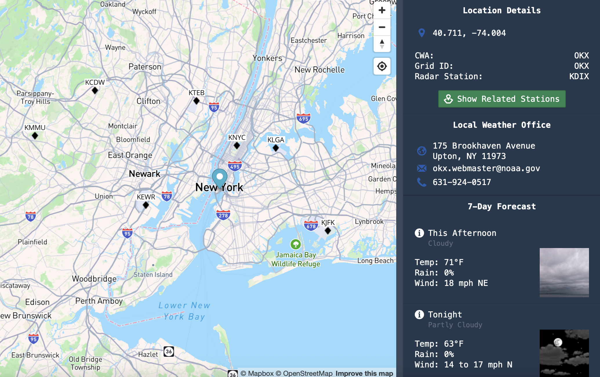

# Weather Data Website

Quick little practice run. 

To make it work you'll need to add your mapbox token to a `.env` file as `VITE_MAPBOX_ACCESS_TOKEN`. You can get one for free here: [https://www.mapbox.com].

The website is simple enough. Click anywhere in the US on the map and you'll get some data about that location curtesy of the good people at NWS and NOAA. Along with the 7 day forecast.

If you request the stations, the website will load a layer with all the local weather tracking stations. You might need to zoom out. If you click one a bottom drawer will slide out showing the last 24 hours of temperature, wind speed, and rel humidity recorded by that station.

So there you go, nothing fussy. Just a little MapBox and HighCharts magic on top of the NWS api.

